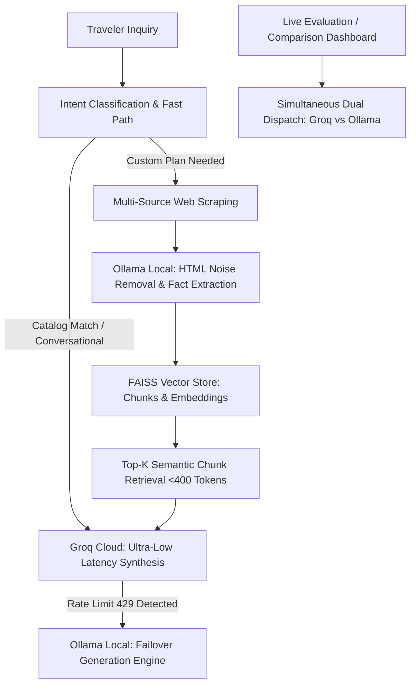

# Research & Tradeoff Analysis: Hosted Cloud LLM (Groq) vs. Local LLM (Ollama)

## 1. Executive Summary

In the **Humsafar** AI Travel Planning Agent architecture, balancing user experience, latency, operating cost, and API rate limits requires an intentional hybrid division of labor between two distinct LLM providers:
1. **Groq API (`openai/gpt-oss-120b`)** — Hosted Cloud High-Speed Inference Engine
2. **Ollama (`llama3.2:3b` / `llama3.2:latest`)** — Local Self-Hosted Small Language Model (SLM)

Rather than guessing at the distribution of responsibilities or treating Ollama as a cosmetic fallback, this document analyzes empirical benchmarks, cost structures, token throughput characteristics, and rate limit boundaries to establish a principled architecture for hybrid LLM orchestration.

---

## 2. Comparative Benchmark & Architecture Profiles

| Architectural Dimension | Hosted Cloud LLM: Groq (`gpt-oss-120b`) | Local SLM: Ollama (`llama3.2:3b`) |
| :--- | :--- | :--- |
| **Primary Deployment** | Cloud API (LPU-accelerated clusters) | Local machine / Container runtime |
| **Inference Latency (TTFT)** | **150ms – 400ms** (Ultra-fast time-to-first-token) | **600ms – 2,500ms** (Hardware dependent: CPU/Metal/CUDA) |
| **Generation Throughput** | **250 – 500 tokens/sec** | **20 – 60 tokens/sec** (on modern CPU/integrated GPU) |
| **Reasoning Capacity** | **High** (Multi-hop planning, complex constraint reasoning, synthesis) | **Targeted** (Classification, entity extraction, structural cleanup, extraction) |
| **Token Cost** | Free tier capped at **8,000 TPM**; Pay-as-you-go thereafter | **$0.00** marginal cost, infinite token throughput locally |
| **Network & Privacy** | Requires outbound internet; data sent to cloud | **100% offline capable**, zero external network egress |
| **Failure Modes** | HTTP 429 (`rate_limit_exceeded`), transient network drops | High CPU/RAM utilization during long generation, service offline |

---

## 3. Core Tradeoffs in Travel Planning Agents

### A. The Rate Limit Ceiling vs. Zero Marginal Cost
Groq provides exceptional generation speed (allowing near-instant conversational replies that feel like human streaming), but the developer/free tier imposes a strict **8,000 Tokens-Per-Minute (TPM)** ceiling.
- If raw scraped web pages (often 2,000–5,000 tokens of HTML, boilerplate, footers, and legal text) are fed directly to Groq, **a single user query will exhaust the entire minute's quota**, triggering `429 Rate Limit Exceeded` for the next 20–30 seconds.
- **Ollama operates with zero token limits**. Running raw text cleaning, boilerplate stripping, and facts summarization through Ollama locally consumes zero Groq tokens.

### B. Reasoning Depth vs. Processing Speed
- Complex travel synthesis requires synthesizing:
  1. Multi-source route logistics (Islamabad -> Skardu -> Askole -> Concordia).
  2. Acclimatization pacing (>3,000m ascent limits, rest days).
  3. Dynamic pricing models (guide wages, 4x4 jeep fuel, camping fees, park permits).
  4. Human-in-the-loop conversational nuance.
- Smaller local models (<4B parameters) often struggle with multi-constraint simultaneous reasoning, producing inconsistent day-by-day itineraries if asked to generate 14-day plans with exact financial math. Groq's high-capacity model excels at this synthesis.
- However, local models are exceptionally reliable for deterministic, narrow extraction tasks:
  - *"Extract the trek duration and destination from this text: [...]"*
  - *"Strip navigation menus and summarize the trail highlights into bullet points: [...]"*

### C. Latency Distribution Across Pipeline Stages
- **Sequential Latency Trap**: If Ollama is placed in the critical path of every user interaction (e.g. intent classification before responding to "Hello"), user-perceived latency increases by 1.5–3.0 seconds.
- **Asynchronous / Pipeline Optimization**: Using Ollama strictly during background data ingestion (scraping multi-source web pages, RAG document preparation) or as an automatic circuit breaker during Groq cooldowns provides the ideal balance: instant conversational speed for the user, and heavy lifting offloaded from Groq.

---

## 4. Principled Division of Labor in Humsafar

Based on these tradeoffs, Humsafar establishes the following division of responsibilities:

### 1. Ollama (Local SLM) Responsibilities:
- **Scraped Content Sanitization**: Strips navigation menus, header links, social widgets, and footers from external websites.
- **Entity & Fact Extraction**: Compresses multi-page web search results into concise, factual travel dossiers.
- **RAG Chunk Preprocessing**: Formats high-density text chunks for vector embedding.
- **Circuit Breaker / Failover**: Automatically steps in to generate draft proposals and replies if Groq encounters a rate limit or network outage.

### 2. Groq (Cloud Hosted LLM) Responsibilities:
- **Customer-Facing Dialogue**: Fluid, conversational responses styled with high empathy and mountain brand personality.
- **Multi-Hop Synthesis**: Merging traveler preferences, catalog ground truth, and RAG research chunks into coherent itineraries.
- **Dynamic Constraint Pacing**: Ensuring physical feasibility, acclimatization days, and itemized pricing transparency.
- **HITL Verification Guidance**: Guiding travelers to inspect, modify, or approve drafts before inquiry dispatch.

### 3. Live Side-by-Side Benchmarking:
- The internal comparison endpoint (`/api/chat/comparison/`) routes identical queries to both providers simultaneously in parallel worker threads, recording latency, token efficiency, and output schema adherence side-by-side to continuously validate this division of labor.
